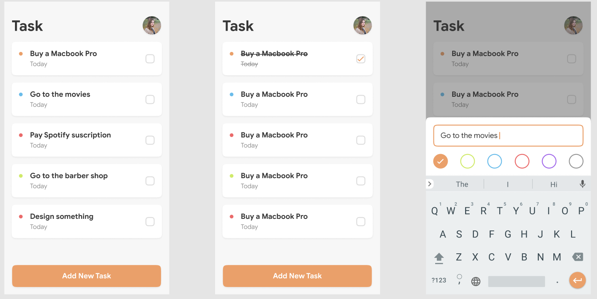

# TODO

This is a development challenge. It is a simple task manager application. 

## Libraries

Here are the libraries used that made this great learning resource possible.

1) For Local Database: [SQLite-Net](https://github.com/praeclarum/sqlite-net)
3) For the circled images: [ImageCircle](https://github.com/jamesmontemagno/ImageCirclePlugin)
